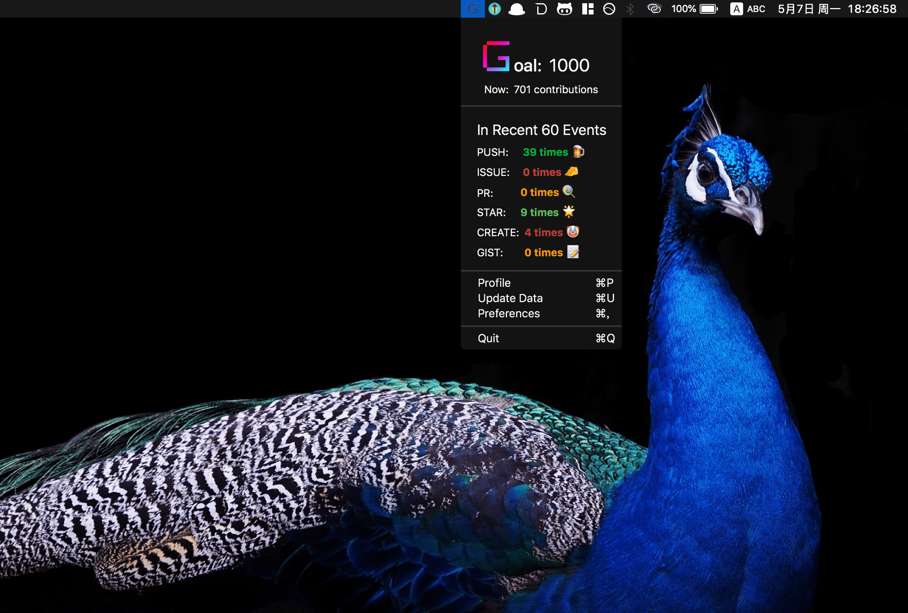

<p align="center">
  
</p>
<h1 align="center">GoalHub</h1>
<p align="center">
  <a href="https://opensource.org/licenses/MIT"></a>
  <a href="https://gitter.im/ilime/GoalHub?utm_source=badge&utm_medium=badge&utm_campaign=pr-badge">
    
  </a>
</p>
<p align="center">:golf: Set your GitHub year contributions' goal.</p>

## Screenshot



## Use it

Go to [release page](https://github.com/ilime/GoalHub/releases)

When you first open GoalHub, you need to set your github username in **Preferences**.

If your want to access private repos. Please go to [https://github.com/settings/tokens](https://github.com/settings/tokens).

Generate your personal token with **repo scope** checked.

## How to develop

```sh
git clone git@github.com:ilime/GoalHub.git && cd GoalHub

// Make sure Carthage existed: brew install carthage
carthage update

// Open it with xcode
```

## How to contribute

Pull a request or open an issue to describe your changes or problems

## License

MIT &copy; [ilime](https://github.com/ilime)
